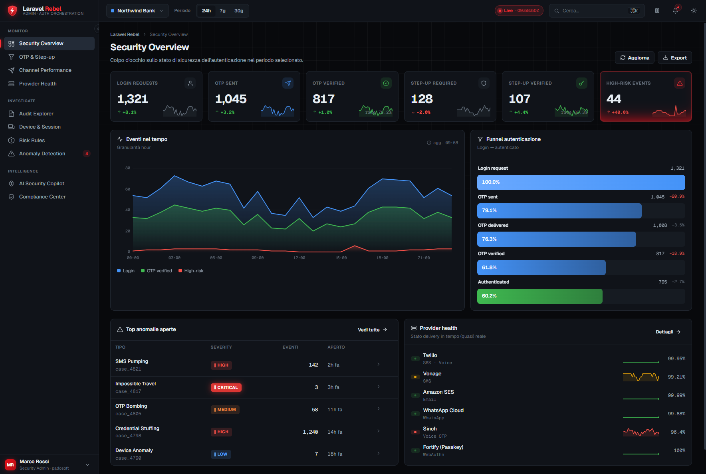
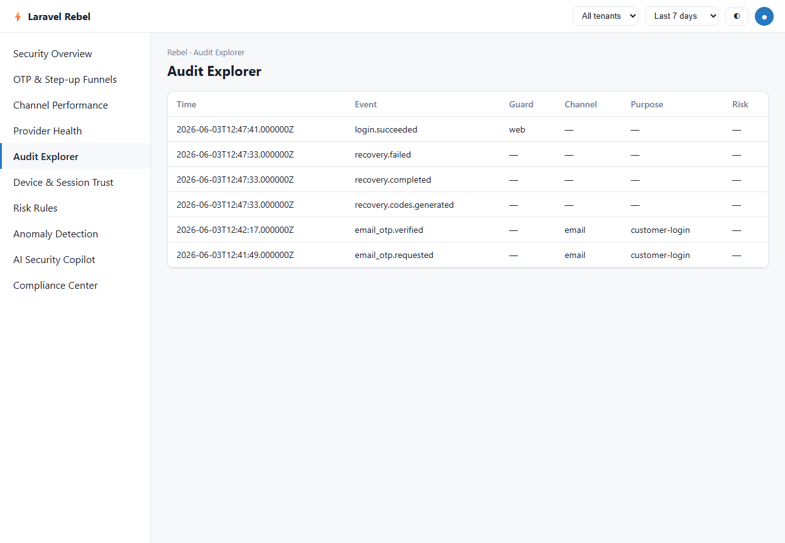

# Laravel Rebel — Integration Demo

> A real **Laravel 13** application that installs, activates and wires together the **entire
> `padosoft/laravel-rebel-*` suite**, and exercises every package end to end — front-end (real
> browser) and back-end. This is the **guarantee gate**: proof the ecosystem works together,
> not just in each package's own unit tests.

<p align="center">
  
</p>

<p align="center">
  
  
  
  
</p>

---

## What this app proves

Every package in the suite is installed and active in one Laravel app, sharing one database,
one session and one audit trail:

`core` · `email-otp` · `step-up` · `bridge-fortify` · `channels` · `channel-twilio` ·
`admin-api` · `admin` · `sessions` · `recovery` · `ai-guard`

Each capability has a clickable demo on the landing page (`/`) so you can exercise it yourself.

### Verified end to end (in a real browser + back-end)

| Flow | Packages exercised | What is asserted |
|---|---|---|
| **Passwordless email-OTP login** (`/account/login`) | core, email-otp | start → real email with code → verify → done; identifier is HMAC'd; `email_otp.requested`/`verified` land in the audit |
| **Web Admin Panel** (`/admin/rebel`) | admin, admin-api, core | fail-closed Gate, panel shell + assets load, widgets call the API, **Audit Explorer shows live cross-package events** |
| **Admin API** (`/rebel/admin/api/v1/*`) | admin-api | `401` without an admin session (fail-closed), `200` with one |
| **Fortify password login** (`/login`) | bridge-fortify | Fortify auth succeeds and its `login.succeeded` / `logout` events are **mapped into the Rebel audit** |
| **Recovery codes** (`/demo/recovery`) | recovery | 10 single-use codes; a code verifies once, reuse is rejected, `remaining` decrements |
| **Sessions & refresh rotation** (`/demo/sessions`) | sessions | a refresh token rotates; presenting the **old token is flagged as reuse** (theft signal) |
| **Step-up policy** (`/demo/stepup`) | step-up | the `checkout-credit-order` purpose loads with its assurance + **PSD2/SCA dynamic linking** on |
| **AI anomaly detection** (`/demo/ai-guard`) | ai-guard | the deterministic detector runs over the live audit window and reports cases raised |

> `channels` + `channel-twilio` boot and register in this app; the Twilio provider is verified
> against the **real Twilio Verify API** by its own opt-in live test suite (it sends a real SMS,
> so it is intentionally not fired on every demo run).

### The Audit Explorer, live

The admin panel reads the unified audit log written by *every* package. After clicking through
the demos you can see OTP, recovery, session and Fortify events side by side:

<p align="center">
  
</p>

---

## Web Admin Panel

`laravel-rebel-admin` ships a self-hosted security-operations dashboard (the dark UI above):
security overview, OTP/step-up funnels, channel performance, provider health, an audit
explorer, device & session trust, risk rules, anomaly cases, an AI copilot and a compliance
center — tenant-aware and **fail-closed** (you must pass the `rebel-admin` Gate). In this demo
`/demo/login-as-admin` signs you in as the seeded admin so you can open `/admin/rebel`.

---

## Run it in 3 minutes

```bash
git clone https://github.com/padosoft/laravel-rebel-demo
cd laravel-rebel-demo

composer install
cp .env.example .env
php artisan key:generate

# SQLite is the default; create the file then migrate + seed
php artisan migrate --seed

# publish the suite's config, migrations and the admin panel assets
php artisan vendor:publish --provider="Padosoft\Rebel\Admin\RebelAdminServiceProvider" --force

php artisan serve
```

Open <http://127.0.0.1:8000> and click through the demos.

> Set `MAIL_MAILER=log` (as in `.env.example`) to read the OTP code from
> `storage/logs/laravel.log` without a real mailbox. The seeder creates
> `demo.customer@example.com` and an admin `admin@demo.test` (password `password`).

---

## Rebel vs Shopify — the whole suite, side by side

This demo exists because Rebel does, self-hosted in your own app, what hosted platforms keep
behind a black box. How the suite compares to **Shopify**'s customer auth and to plain Laravel:

| Capability (all live in this demo) | **Laravel Rebel** | Shopify | Fortify only | Sanctum/Passport |
|---|:---:|:---:|:---:|:---:|
| Passwordless email-OTP login | ✅ | ✅ | ❌ | ❌ |
| Risk-based step-up per action | ✅ | ❌ | ❌ | ❌ |
| **PSD2/SCA dynamic linking** | ✅ | ❌ | ❌ | ❌ |
| Refresh-token rotation + **reuse detection** | ✅ | ❌ | ❌ | ❌ |
| Single-use, hashed recovery codes | ✅ | ✅ | ➖ | ❌ |
| Unified, HMAC'd audit trail | ✅ | ➖ | ❌ | ❌ |
| Self-hosted **web admin panel** over your data | ✅ | ➖ (hosted) | ❌ | ❌ |
| Anomaly detection + advisory AI | ✅ | ➖ | ❌ | ❌ |
| **Self-hosted, you own the data** | ✅ | ❌ | ✅ | ✅ |
| Multi-tenant for *your* app | ✅ | ❌ | ❌ | ❌ |

> ✅ built-in · ➖ partial / hosted-only / opaque · ❌ not available. Shopify is a great hosted
> product, but it's a closed black box you can't self-host, extend, audit or run multi-tenant.
> Rebel gives you the same capabilities — and several Shopify doesn't have — in your own Laravel app.

---

## License

MIT — see [LICENSE](LICENSE). Built by [Padosoft](https://www.padosoft.com).
